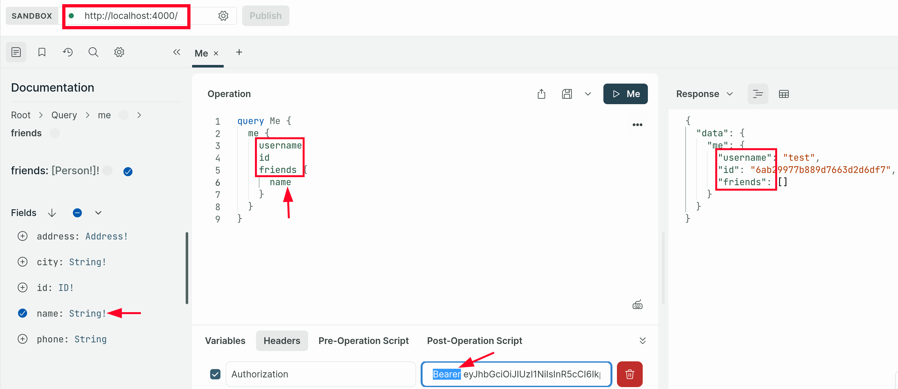

This is [part 8 of the fullstack open course](https://fullstackopen.com/en/part8) by <https://studies.cs.helsinki.fi>

[New Course Platform for GraphQL]( https://courses.mooc.fi/org/uh-cs/courses/full-stack-open-graphql )

### Github Actions Test Status

Branches `chapter-2` and `chapter-3` do not have triggered tests through GitHub workflow actions. There is no `chapter-1` branch.

<details>
<summary> chapter-4 </summary>

[](https://github.com/cherylfong/netscapia-graphql/actions/workflows/test-chapter4.yml)

</details>
<br/>

## Chapter 2 | GraphQL Server

### Basics

- Describes the data wanted by the browser before sending it to the API with a HTTP POST request.
- All GraphQL queries are sent to the same API URL.
- All GraphQL requests are POST requests.

### Schema and queries

All GraphQL applications have a [schema](https://graphql.org/learn/schema/) that describes the data sent between the client and server.

Practically every GraphQL schema describes a Query, which tells what kind of queries can be made to the API.

Exclamation marks are used to mark which return values and parameters that cannot be `null`.

A query can be made to return any field described in the schema.

GraphQL query describes only the data moving between a server and the client. On the server, the data can be organized and saved in any way. GraphQL does not have anything to do with databases. It does not care how the data is saved.

A GraphQL server must define resolvers for each field of each type in the schema. Otherwise, [Apollo GraphQL](https://www.apollographql.com/docs/apollo-server/api/apollo-server/) will define [default resolvers](https://www.graphql-tools.com/docs/resolvers/#default-resolver).

### Mutations

All operations that cause change are done with mutations. Mutations are described in the schema as the keys of type `Mutation`.

Mutations also require a resolver.

### Error Handling

Some error handling are automatically done with GraphQL [validation](https://graphql.org/learn/validation/).

## Chapter 3 | React and GraphQL

[Apollo Client](https://www.apollographql.com/docs/react/) handles server communication similar to Axios but is a higher-order library capable of abstracting the unnecessary details of the communication.

Installation

```bash
npm install @apollo/client graphql
```

The application can communicate with a GraphQL server using the `client` object. The client can be made accessible for all components of the application by wrapping the App component with `ApolloProvider` component.

Apollo Client offers a few alternatives for making [queries](https://www.apollographql.com/docs/react/data/queries/). Currently, the use of the hook function [useQuery](https://www.apollographql.com/docs/react/api/react/hooks/#usequery) is the dominant practice.

### Caching and Mutations

Apollo client saves the responses of queries to [cache](https://www.apollographql.com/docs/react/caching/overview). To optimize performance if the response to a query is already in the cache, the query is not sent to the server at all.

The hook function [useMutation](https://www.apollographql.com/docs/react/api/react/hooks/#usemutation) provides the functionality for making mutations.

A way to keep the cache in sync is to use the useMutation hook's [refetchQueries](https://www.apollographql.com/docs/react/data/refetching/) parameter to define that the query fetching an array for example is done again whenever a new element is created.

### Apollo Client Handling Application State

It is tyipcal for Apollo Client manage most of the application's state, besides for form state for example. Using Redux or Zustand may not be necessary when using GraphQL.

In some cases, Apollo enables saving the application's local state to Apollo [cache](https://www.apollographql.com/docs/react/local-state/local-state-management/).

## Chapter 4 | Database and User Administration

### Server Application File and Directory Organization

Organization structure of the Server application directory and files:

- `index.js` is the main entry point of the application, whose only responsibility is the startup logic. It ensures that different parts of the application are started in the correct order.

- The GraphQL schema is defined in the `schema.js` module. It describes the structure of the API—for example, which queries and mutations are possible through the API and defines object fields.

- Application logic is defined in the `resolvers.js` module. Its responsibility is to define behavior for different queries, where the data is fetched, and how it is processed.

- `server.js` configures and starts the Apollo Server.

#### Mongoose and Apollo

Database setup with mongoose.

```bash
npm install mongoose
```

Define `MONGODB_URI` and `PORT` enviroment variables in `.env` file. Instructions can be found on this [page](https://fullstackopen.com/en/part3/saving_data_to_mongo_db#defining-environment-variables-using-the-dotenv-library).

In reference to `resolvers,js`:

- Mongodb's identifying field for an object is called `_id`, it necessary to parse the name of the field to `id` ourselves. However, GraphQL can do this automatically.

- Resolver functions now return a promise, when they previously returned normal objects (prior to the refactor when mongoose is applied). When a resolver returns a promise, Apollo server [sends back](https://www.apollographql.com/docs/apollo-server/data/resolvers#return-values) the value the promise resolves to.

#### JWT Token Passing Using Apollo Server Context

The most convenient way to pass the token that arrives with the request to the resolvers is to use Apollo Server’s [context](https://www.apollographql.com/docs/apollo-server/data/context/).

With the context, we can perform things that are common to all queries and mutations, for example [identifying the user](https://www.apollographql.com/blog/authorization-in-graphql/) associated with the request.

See [`server.js`](phonebook/server/server.js) to understand how the JWT token is required during server startup.

Below is an image that shows passing the JWT Bearer token via the Apollo Client:


#### Recap on Mongoose Usage

```javascript
    // .exec() means: “Run this Mongoose query.”
    // await means: “Pause here until the promise finishes.”
    // Mongoose queries are thenable, so this often also works:
    const books = await Book.find({})

    // But .exec() makes the query execution explicit and     returns a standard promise.
    Book.find(filter).populate('author').exec()
```
